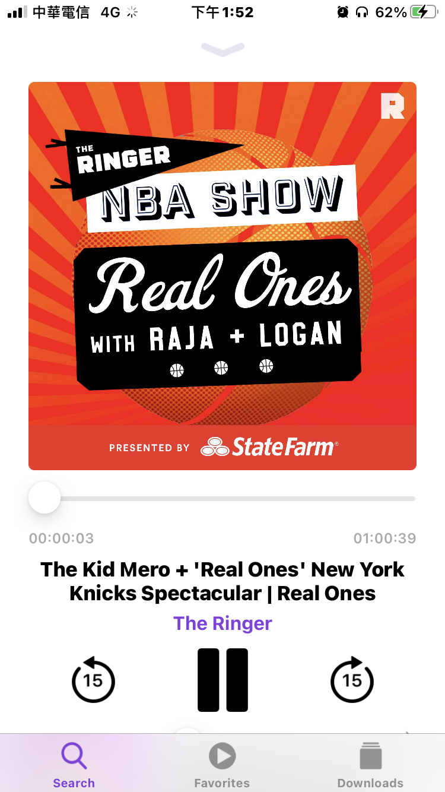
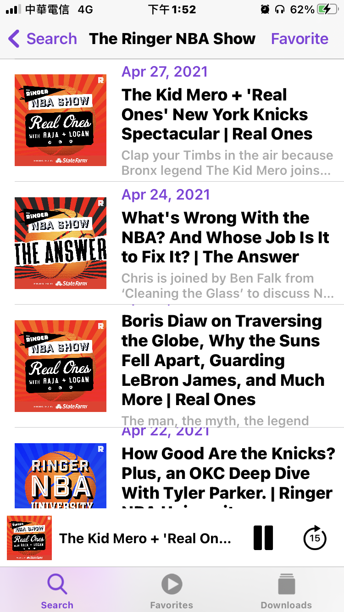
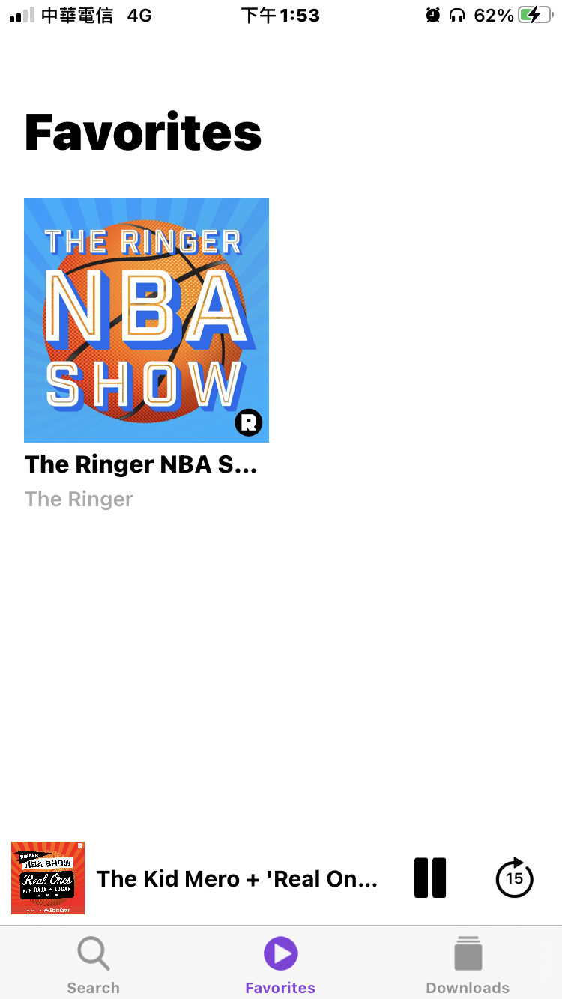
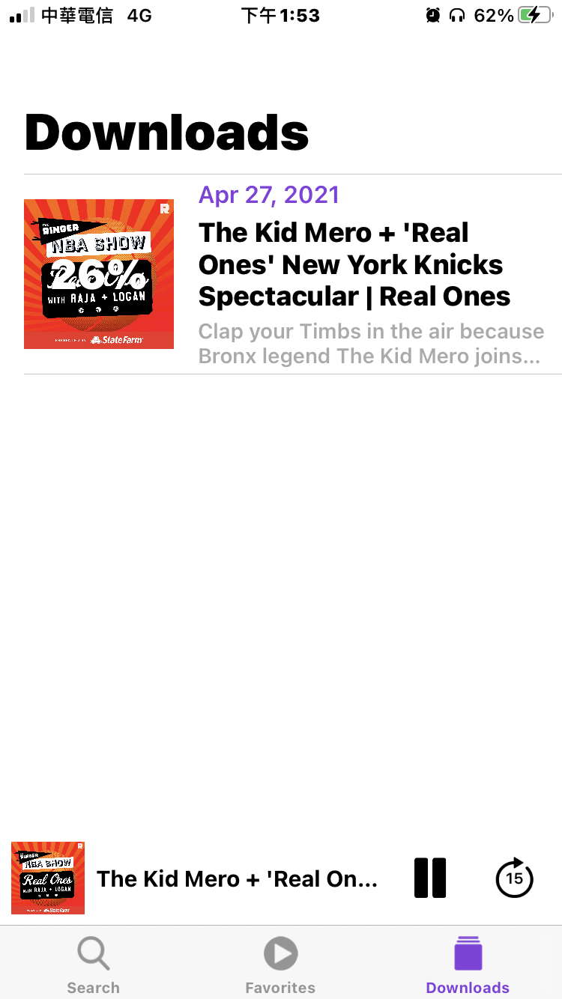

# IRPodcast 

- IRPodcast is a copy project of [OldPodcasts](https://github.com/Karambirov/OldPodcasts), which is really good but it is in the refactor progress now. The lastest version of `OldPodcasts` cannot not work, so if you like `OldPodcasts`, please feel free to use this one `IRPodcast`.
- IRPodcast is a powerful podcast player for iOS.

## Features
- Search podcasts.
- Support streaming play and local play.
- Favorites. 

## Future
- Support cache while streaming play.

## Technologies
- JSON parsing using `Codable`.
- XML parsing podcasts' meta information ([FeedKit](https://github.com/nmdias/FeedKit)).
- Cache images ([SDWebImage](https://github.com/SDWebImage/SDWebImage)).
- Cache streamings ([IRHTTPCache](https://github.com/irons163/IRHTTPCache)).

## Install
### Git
- Git clone this project.

### Cocoapods
- Not support yet.

## Screenshots
|Display|Setting|
|---|---|
|||
|||
